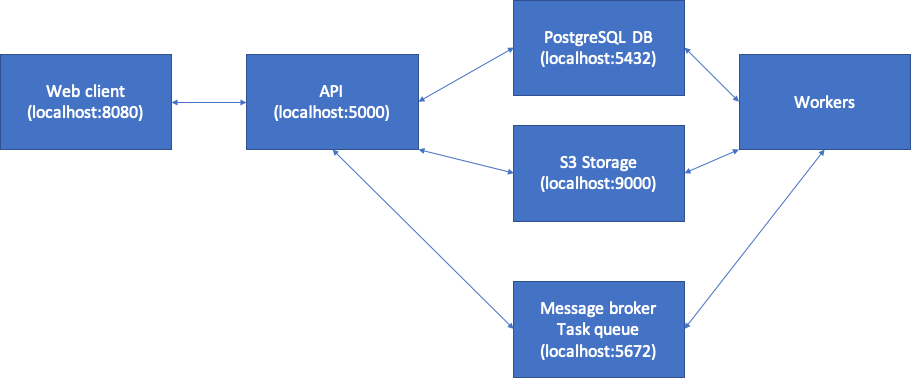

# QbESTDocks

A set of pre-configured Docker containers for deploying a Query-by-Example Spoken Term Detection service.

**Very much work in progress — do not use in production!**

## Usage

### Launch/build containers

```
git clone https://github.com/parledoct/qbestdocks.git
cd qbestdocks
# Launch containers in detached mode
docker-compose up -d

# If needed, use --build and --force-recreate to launch a fresh set
# docker-compose up -d --build --force-recreate
```

### Monitor services

```
# Follow the stdout of a specific container
docker-compose log -f api
```

### Teardown

```
docker-compose down
```

## Motivation

This purpose of this project is two-fold. The first is to provide a usable QbE-STD app for end users. A broader goal is to develop a re-usable project template for quickly developing and deploying services for speech processing tasks (e.g. forced alignment, speech-to-text). The intended end users for these services are those involved in language documentation work.

### Architecture

Given the broader goal, the project implements the backend on a set of mature and well-maintained technologies (Docker, PostgreSQL, S3, Celery) that can easily interface with different programming languages and that are entirely agnostic to the choice of frontend and relatively agnostic to the language in which the API is implemented (there are Celery clients for Python, Node.js, PHP, and Go).

The use of Celery (an asynchronous task queue) helps with a) long-running tasks (e.g. training a speech recognition model) and b) the ability to distribute different task requests from different users to various workers (on different machines, if need be). 



#### Clients

Note for all services below user/password details are configured as environment variables inside `docker-compose.yml`.

- API: Documentation automatically generated by FastAPI at http://localhost:5000/docs
- S3: Minio comes with a web client that can be access at http://localhost:9000 (access key: `minio`, secret key: `minio123`).
- PostgreSQL: Use any of https://wiki.postgresql.org/wiki/PostgreSQL_Clients (e.g. [pgAdmin](https://www.pgadmin.org/)) to access database at postgresql://localhost:5432/postgres (username: `postgres`, password: `postgres`)
- RabbitMQ Management: http://localhost:15672 (username: `guest`, password `guest`)

