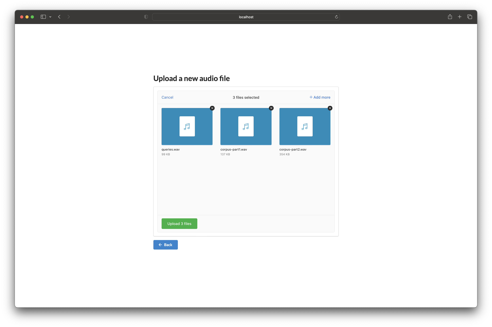
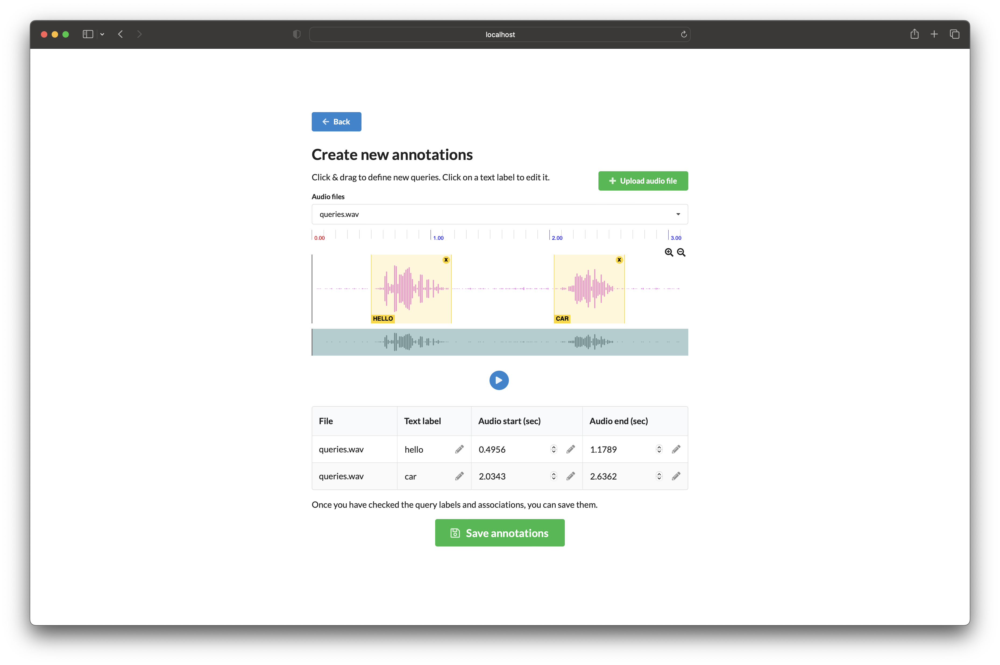
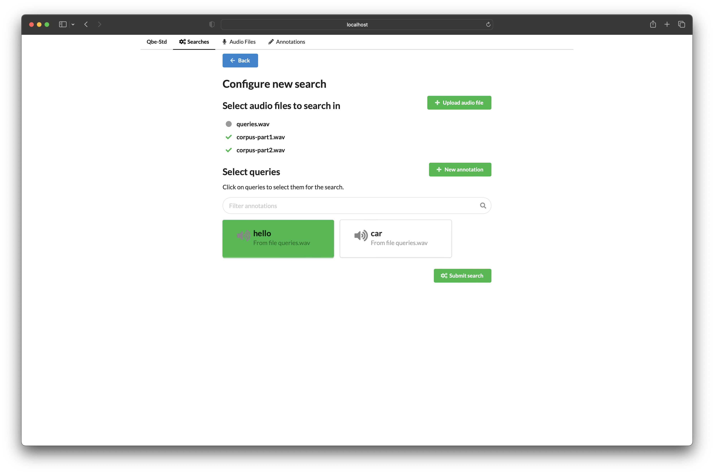
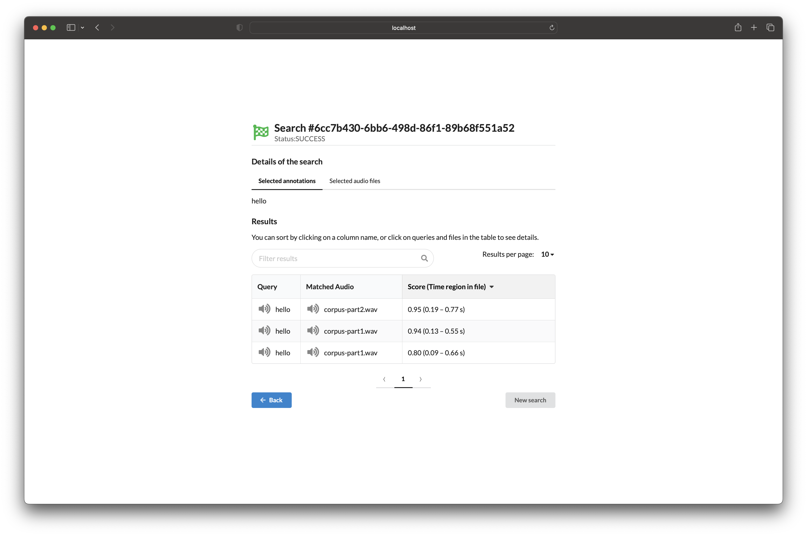

# QbESTDocks

<p align="center">

</p>

A reference implementation for a Query-by-Example Spoken Term Detection service.

## About

This repository accompanies our QbE-STD evaluation experiments (https://github.com/fauxneticien/qbe-std_feats_eval) and paper (https://arxiv.org/pdf/2103.14583; 10-min video summary: https://www.youtube.com/watch?v=FXYP5hoXP8o), providing a reference implementation (i.e. not production ready!) to demonstrate the various components needed to create a self-service QbE-STD system for end users.

## Implementation overview

### Back-end

The backend intentionally relies on a set of mature and well-maintained technologies (Docker, PostgreSQL, S3, Celery) that can easily interface with different programming languages and that are entirely agnostic to the choice of front-end and, with Celery as a task queue, also *relatively* agnostic to the language in which the API is implemented (there are Celery clients for Python, Node.js, PHP, and Go).
An asynchronous task queue is necessary to deal with long-running tasks (e.g. running dynamic time warping based search on all pairs of query and corpus audio files).

<p align="center">

</p>

### Front-end

The front-end (created by [Laura Dominé](https://temigo.github.io/)) lets the end user upload audio files to perform QbE searches:

1. Upload audio files (demo files available in `docs/demo-files.zip`)

  

2. Annotate speech regions of interest to be used as search queries

  

3. Configure new search with 1 or more query and corpus audio files

  

4. View search results (time regions in the corpus audio files with high similarity to the search queries)

  

## Usage

### Launch/build containers

```
git clone https://github.com/parledoct/qbestdocks.git
cd qbestdocks
# Launch containers in detached mode
docker-compose up -d

# If needed, use --build and --force-recreate to launch a fresh set
# docker-compose up -d --build --force-recreate
```

### Monitor services

```
# Follow the stdout of a specific container
docker-compose log -f api
```

### Access services

Note for all services below user/password details are configured as environment variables (see `docker-compose.env`).

- API: Documentation automatically generated by FastAPI at http://localhost:5000/docs
- S3: Minio comes with a web client that can be access at http://localhost:9000 (access key: `minio`, secret key: `minio123`).
- PostgreSQL: Use any of https://wiki.postgresql.org/wiki/PostgreSQL_Clients (e.g. [pgAdmin](https://www.pgadmin.org/)) to access database at `postgresql://localhost:5432/postgres` (username: `postgres`, password: `postgres`)
- RabbitMQ Management: http://localhost:15672 (username: `guest`, password `guest`)

### Teardown

```
docker-compose down
```
